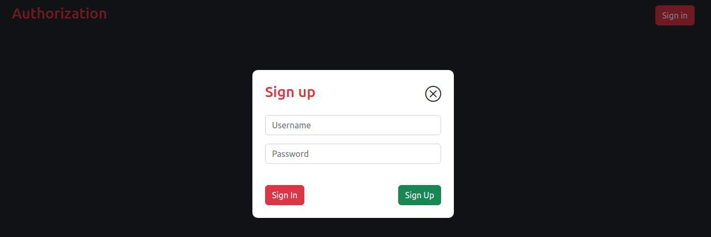
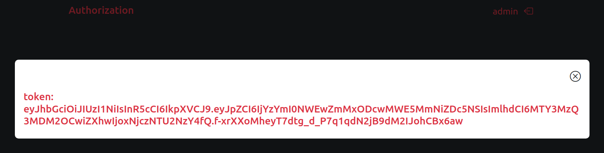
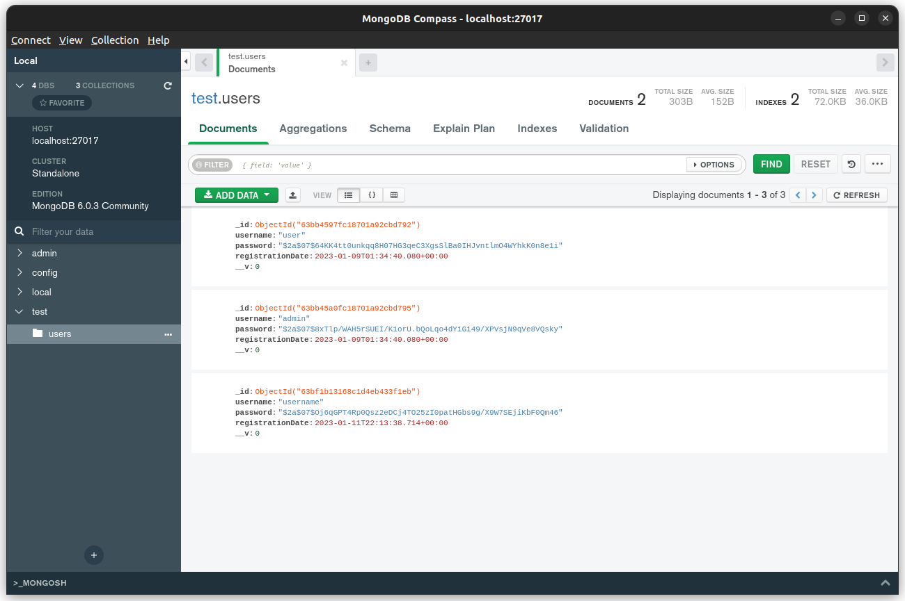

# base authorization

#### functional

-   registration of new users
-   login
-   logout
-   modal notification: successful registration of a new user, registration and authorization errors, saving values in the output field when errors are output, user's token

#### basic npm packages

-   express, express-validator
-   jsonwebtoken, bcryptjs
-   mongodb, mongoose
-   webpack
-   axios
-   typescript
-   bootstrap

